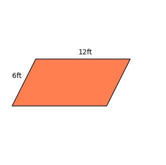
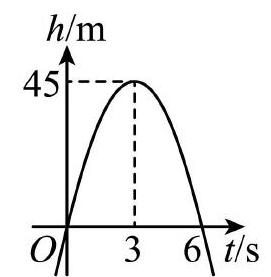

# AVP0624 — Single visual target

DynaMath:41 / MV-MATH:624_1 · different type · Numeric representation and conversion

## Shared or similar visual information

The numerical notations 6 ft (left) and 6 (right).

## Evidence locations

- Left image: The notation 6 ft appears beside the left slanted side.
- Right image: The notation 6 appears below the right intercept.

## Mathematical meanings

Left image: 6 ft measures the slanted side. Right image: 6 s is the time at which the height returns to zero.

## Same mathematical meanings

no

## Rationales

The notation on the left represents a segment length. The notation on the right represents a time coordinate.

Only the selected target is annotated. AI visual-review draft; not independently double-annotated by humans.
